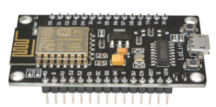

How to configure NodeMCU to use MQTT with TLS encryption. The broker will be
installed on Ubuntu 16.04 server, but you should be able to configure MQTT
broker on other distributions.

I explored HTTPS, but this is not working with the HTTP module in the NodeMCU
dev branch. In any event the TLS module uses quite a bit of memory, so you must
be judicious as you add additional code on the ESP8266.

## Configure MQTT broker
I'm using a Ubuntu 16.04 server via VirtualBox to create the broker. Eventually
this would be installed on a SBC like a NanoPi Duo to handle messages 24/7 with
your connected IoT devices. Note this example uses only server certificate. You
can use client certificates to validate clients.
* Start with fresh Ubuntu 16.04 server install and apply all upgrades.

### Install Mosquitto broker 
* `sudo apt-get install mosquitto mosquitto-clients git-core`
* Open terminal subscribe to topic
    * `mosquitto_sub -h localhost -t test`
* Open terminal publish to topic
    * `mosquitto_pub -h localhost -t test -m "hello test"`
    * You should see message on terminal running mosquitto_sub
    * Press Ctrl-C on terminal running mosquitto_sub

### Configure SSL 
* Create CA and server certificates. I'm using a [generate-CA.sh](https://github.com/owntracks/tools/raw/master/TLS/generate-CA.sh)
script, but I've included a copy [locally](https://raw.githubusercontent.com/sgjava/nodemcu-mqtt-tls/master/scripts/generate-CA.sh) in case it dissapairs. 
    * `wget https://raw.githubusercontent.com/sgjava/nodemcu-mqtt-tls/master/scripts/generate-CA.sh`
    * `chmod a+x generate-CA.sh`
    * `./generate-CA.sh`
* Copy generated CA
    * `sudo cp ca.crt /etc/mosquitto/ca_certificates/.`
* Copy generated certs (use actual file names which are prefixed by hostname)
    * `sudo cp myhost.crt myhost.key /etc/mosquitto/certs/.`
* Configure mosquitto for SSL (use actual finel names for certs)
    * `sudo nano /etc/mosquitto/conf.d/default.conf`
```# Plain MQTT protocol
listener 1883

# End of plain MQTT configuration

# MQTT over TLS/SSL
listener 8883
cafile /etc/mosquitto/ca_certificates/ca.crt
certfile /etc/mosquitto/certs/myhost.crt
keyfile /etc/mosquitto/certs/myhost.key

# End of MQTT over TLS/SLL configuration
```
* `sudo service mosquitto restart`
* Open terminal subscribe to topic
    * `mosquitto_sub -h localhost -t test -p 8883 --cafile /etc/mosquitto/ca_certificates/ca.crt`
* Open terminal publish to topic
    * `mosquitto_pub -h localhost -t test -m "hello ssl" -p 8883 --cafile /etc/mosquitto/ca_certificates/ca.crt`
    * You should see message on terminal running mosquitto_sub
    * Press Ctrl-C on terminal running mosquitto_sub

### Set password 
* `sudo mosquitto_passwd -c /etc/mosquitto/passwd <user_name>`
* `sudo nano /etc/mosquitto/conf.d/default.conf`
```password_file /etc/mosquitto/passwd
allow_anonymous false
```
* `sudo service mosquitto restart`
* Open terminal subscribe to topic
    * `mosquitto_sub -h localhost -t test -p 8883 --cafile /etc/mosquitto/ca_certificates/ca.crt -u <user_name> -P <password>`
* Open terminal publish to topic
    * `mosquitto_pub -h localhost -t test -m "hello ssl" -p 8883 --cafile /etc/mosquitto/ca_certificates/ca.crt -u <user_name> -P <password>`
    * You should see message on terminal running mosquitto_sub
    * Press Ctrl-C on terminal running mosquitto_sub

## Configure NodeMCU
[Flash](https://github.com/sgjava/nodemcu-lolin) your ESP8266 with latest
NodeMCU dev branch. I'm using ESPlorer, but you can use other IDE or command
line tools to upload and compile code.

The NodeMCU code subscribes to a unique input topic defined by 
node-hostname-in. hostname is defined as node-node.chipid().
Only one output topic "node-out" is used since hostname is
passed as part of the response. You send commands to the input
topic in the following format command:param1,param2, ...
You can add your own commands by addint it to the action table
and writing a callback function.
* Use [NodeMCU custom builds](https://nodemcu-build.com) to create a NodeMCU.
Select dev branch and MQTT and TLS modules.
* Edit config.lua for your wifi and MQTT details
* Use ESPlorer to upload code in the following order and reset device.
     * config.lua
     * wifi_connect.lua
     * mqtt_connect.lua
     * main.lua
     * compile.lua     
     * init.lua     
* Log into MQTT server with three terminals. Make sure the topic name is the
one you see in the ESPlorer console when you run it the first time.
     * `mosquitto_sub -h localhost -t node-000000-in -p 8883 --cafile /etc/mosquitto/ca_certificates/ca.crt -u <user_name> -P <password>`
     * `mosquitto_sub -h localhost -t node-out -p 8883 --cafile /etc/mosquitto/ca_certificates/ca.crt -u <user_name> -P <password>`
     * `mosquitto_pub -h localhost -t node-000000-in -m "echo:hello" -p 8883 --cafile /etc/mosquitto/ca_certificates/ca.crt -u <user_name> -P <password>`
     * The last command echos "hello" in the ESPlorer console
* Built in commands that can be called
     * echo:hello (echos hello to device console)
     * gpio_write:1,0 (write 0 to pin 1)
```NodeMCU custom build by frightanic.com
	branch: dev
	commit: be53d5c9f399eb67895961ed840e766539a93cc1
	SSL: true
	modules: file,gpio,mqtt,net,node,tmr,uart,wifi,tls
 build 	built on: 2018-03-16 19:40
 powered by Lua 5.1.4 on SDK 2.1.0(116b762)
> hostname: node-000000
ip: 192.168.1.69
subscribed to node-000000-in
=node.heap()
14608
>
```   
     